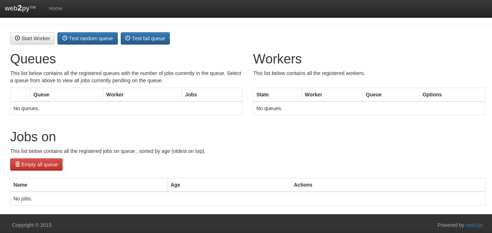
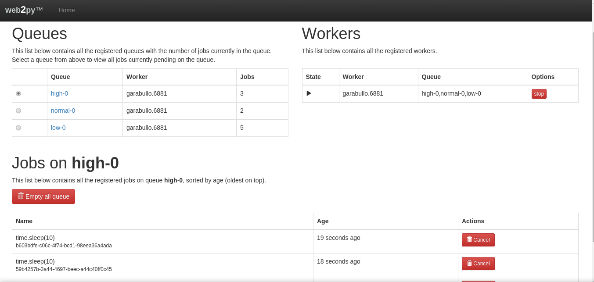
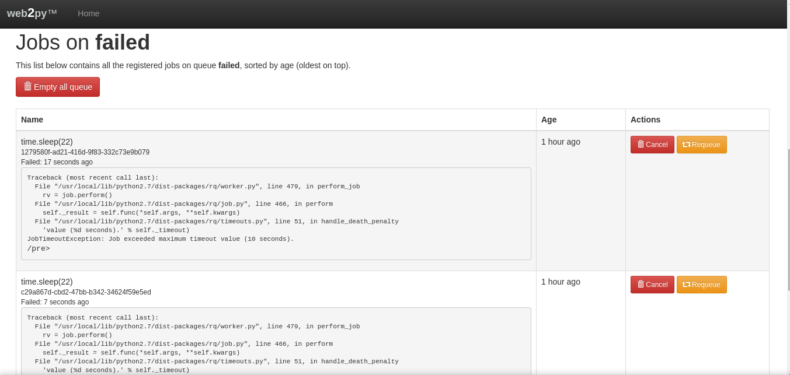

# web2py-rq-dashboard

`web2py-rq-dashboard` is a dashboard for monitoring RQ (Redis Queue) Python library for queueing jobs and processing them in the background. This app have been adapted to web2py from the original one `https://github.com/nvie/rq-dashboard` to make easier the integration with future web2py apps.

## It looks like this:








## Installing

### RQ library and redis:
```
pip install rq
apt-get install redis
```

### How to install the Dashboard in Linux, windows or Mac:

0. Download the las version of web2py and unzip:
```
cd /opt
wget http://www.web2py.com/examples/static/web2py_src.zip
unzip web2py_src.zip
```

0. Download the app inside web2py:
```
cd /opt/web2py/applications
git clone https://github.com/josedesoto/monitor.git
```

0. Run web2py:
```
python /opt/web2py/web2py.py
```

0. Open the URL: http://localhost:8000/rq


For more info about rq library: `http://python-rq.org`
